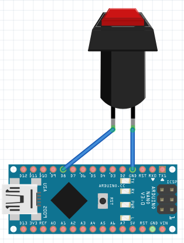
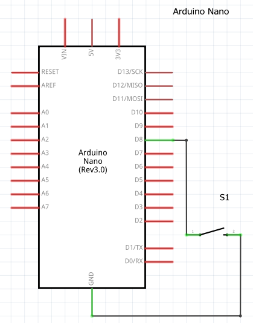

0. Wire a momentary pushbutton between 'D8' and 'ground' on your Arduino.
    * 
    * 
0. Plug the Arduino in, 
0. Upload the [StageOnBtnD13.ino](StageOnBtnD13.ino) sketch,
0. In KSP create a simple rocket with two stages. I used a central SRB stage a 3xRadial SRB stage,
0. Start the kRPC server, 
0. Confirm that above the "start" button in kRPC it says "KSP controller @ COMx". 
	* tx and rx LEDs on the Ardino Nano were flashing rapidly
	* "show info" button in the kRPC window was showing data being read/written to as a constantly changing number
	* The radial button next to "KSP controller @ COMx" was rapidly changing from green to black.
	
0. Press the reset button on the Arduio,
0. Wait roughly 4 seconds (let the Arduino boot after the reset),
0. Observe that the next stage is triggered.